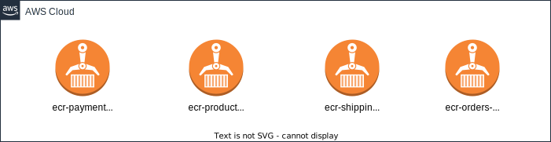

### Facultad de ingeniería | Escuela de tecnología - DevOps 

Entregado como requisito para la obtención de la certificación en Devops.

Rafael Fernández - 287127 
Maximiliano Migues - 205973 
Matias Techeira - 176519 

Tutor: Lic. Federico Barcelo

## Abstract

Se establece como objetivo primordial mejorar la agilidad en el desarrollo y la calidad del software, asegurando simultáneamente una mayor eficiencia operativa. La estrategia propuesta permitirá a la empresa mantener su competitividad en un mercado dinámico y en constante evolución.

El equipo multidisciplinario encargado de liderar la implementación de DevOps en áreas clave como desarrollo, control de calidad y operaciones, se embarcará en la exploración de estrategias avanzadas de automatización y escalabilidad en la nube. Este enfoque no solo promete acelerar la entrega de software, sino también garantizar la fiabilidad y flexibilidad necesarias para adaptarse a las cambiantes demandas del mercado.

## Presentación del cliente y la problemática

La problemática principal de esta empresa en el sector retail radica en la necesidad urgente de adaptarse constantemente y entregar eficientemente software para mantenerse competitiva en un mercado en constante cambio. La entrega de software in-house actual no cumple con los requisitos de velocidad y calidad necesarios para enfrentar los desafíos del entorno dinámico del retail.

Por parte de la directiva se propuso la implementación de un modelo DevOps como solución para acelerar el "time-to-market" y mejorar la calidad del software, aprovechando al máximo las ventajas de la nube. Esta estrategia busca no solo mejorar la agilidad en el desarrollo y la calidad del software, sino también lograr una mayor eficiencia operativa para mantener la competitividad.

## Solución planteada ante la problemática
**Puntos clave**

Desmenuzando el objetivo central planteado en el Abstract, el equipo se plantea las siguientes metas específicas:

1. Implementar la infraestructura en la plataforma de nube de AWS, utilizando para ello la herramienta Terraform (IaC).
2. Desarrollar un proceso integral de integración continua y entrega continua (CI/CD).
3. Incorporar pruebas automáticas y análisis de código estático (SonarCloud).
4. Gestionar microservicios empaquetados de backend en contenedores, para su despliegue en un sistema de orquestación en la nube de AWS, específicamente utilizando imágenes Docker en ECS Fargate.
5. Desplegar aplicación frontend sobre el servicio S3 bucket de AWS.
6. Mantener una eficiencia óptima en las prácticas de las metodologías ágiles, con el fin de ofrecer una solución que potencie tanto la calidad como la velocidad de los procesos.

### Arquitectura de la Solución

Se elgió una solución desplegada en la nube que permite satisfacer los requerimeintos planteados, y para este caso se eligió la nube AWS dabido a que es una de las tres más importantes y que los integrantes del equipo estaban familiarizados con la misma. En particular se decidió utilizar un modelo de servicio PaaS para acelerar el despliegue de la infraestructura así como también traspasar al proveedor de nube parte de la carga administrativa asociado.
La implementación en AWS fue realizada mediante el servicio ECS (Elastic Containter Service) con lanzamiento utilizando la modalidad FARGATE (Serverless).
Se generaron 3 ambientes distintos (desarrolo, testing y producción)
A continuación se muestra un diagrama que muestra el despliegue de cada uno de los microservicios de Back-end por cada ambiente.

Los componentes son los siguientes:
Se generó una VPC en la region us-east-1 por cada ambiente con dos subredes públicas en distintas areas de disponibilidad (us-east-1a y us-east-1b). Estos recursos son compartidos por todos los contenedores de backend en cada ambiente.
La salida a internet desde la VPC se realiza con un Internet Gateway en conjunto con una tabla de ruteo. Para cada ambiente se generó un Cluster de ECS y luego para cada microservicio desplegado se genera un Application Load Balancer que permite balancear la carga entre las dos subredes, así como también proveer de una IP pública para el acceso desde internet. La cantidad de instancias de contenedor desplegadas se puede especificar por ambiente y se seteo inicialmente en 2 para el ambiente de producción, donde tiene sentido aplicar el balanceo de carga y se asegura una alta disponibilidad y en 1 para los ambientes de desarrollo y testing. Si bien no tiene mucho sentido aplicar el balanceador de carga hacia una unica instancia de todos modos es util por la utilización de las IP públicas para resolver la dependencia del MS de orders.
Como elemento complementario para el despliegue dentro de la nube y de interacción con pipelines de CI/CD se generaron los recursos de ECR (Elastic Container Registry) y se optó por utilizar uno por cada servicio. Esto permite mantener una independencia entre MS y facilita la utlización de tags para las imagenes subidas a los mismos. En cada uno de estos registros se va a utilizar un tag por cada ambiente y quedan representados de esta manera en la infraestructura:

Por último también se generaró la infraestructura para desplegar el frontend para lo cual se utilizó un S3 Bucket por ambiente. La elección se debe a que el contenido a desplegar es estático y utilizar un S3 Bucket público es una manera económica de permitir su consumo y evitar soluciones más complejas como levantar una instancia de EC2 con un webserver o algún contenedor en ECS, y de alguna manera también trasferir el costo adminsitrativo de mantener el contenido en linea.  
 
Para el aprovisionamiento de la infraestructura se utilizó la aplicación de Infraestructura como Código (IaC) Terraform. Se opto por la utilización del almacenamiento del estado en un bucket de S3 y proteger en caso de concurrencia con una tabla de DynamoDB.
Debido a que se deben genear 3 ambientes similares y por simplicidad se utilizó la alternativa de generar archivos .tfvar por cada ambiente. Debido a que para generar la infraestructura para cada ambiente es necesario cambiar de workspace y utilizar el archivo .tfvar correspodiente se generaron archivos .sh muy simples para facilitar el uso así como evitar posibles errores a la hora de modificar cada ambiente.
Por ejemplo para generar el ambiente de desarrollo se utiliza ./crear_dev.sh que tiene el siguente código:

    terraform workspace select dev
    terraform apply -var-file="dev.tfvars" -auto-approve

El archivo destroy_dev.sh es análogo utlizando la el comando terraform destroy en vez del apply. El poder generar de a un ambiente facilitaba la prueba de generación de infraestructura por ejemplo en el ambiente de desarrollo y cuando se estabilizaba se pasaba al resto de los ambientes.
También hay una variante de estos archivos que sirven para crear y destruir todos los ambientes corriendo de manera secuencial los comandos para cada ambiente.
A modo de ejemplo se muestra el archivo prod.tfvars:

    environment_name = "Produccion"
    environment_prefix = "prod"
    availability_zone_1 = "us-east-1a"
    availability_zone_2 = "us-east-1b"
    creoECRs = "false"
    s3_bucket_postfix = "-s3grp3-webapp"
    be_desired_count = 2
    be_cpu = "256"
    be_memory = "512"

Solamente vale la pena comentar algunas de estas variables, por ejemplo "creoECRs" que solamente se encuentra en true para el ambiente de desarrollo ya que los ECR se utilizan para todos los ambientes. Luego las variables be_cpu y be_memory asociados a la utilización de los recursos de cpu y memoria para los contenedores de backend y el be_desired_count para la cantidad de instancias de contenedor levantadas de forma concurrente para cada MS.
Los archivos de iac se encuentran dentro de un único directorio llamado iac-terraform dentro del repositorio Devops.

### Estrategia para CI/CD 

**Backend**

El proceso de integración y despliegue continuo fue realizado mediante **GitHub Actions** e implementado en el repositorio de **DevOps**, de esta manera centraliza y estandariza el ciclo de vida del software de los microservicios del backend. Esta arquitectura de CI/CD permite a cada microservicio del backend invocar un workflow genérico **"cicd-generic.yml"**, ya que su lógica es similar pero a su vez proporcionando parámetros específicos que adaptan la ejecución a sus necesidades individuales.

La utilización de un workflow genérico para el backend facilita la gestión del código y la infraestructura, permitiendo actualizaciones y mejoras centralizadas que se propagan automáticamente a todos los microservicios del backend. Los microservicios, a través de sus respectivos repositorios, hacen uso de un archivo **'caller.yml'**, que activa el workflow genérico. Este 'caller' es un manifiesto que, al detectar cambios en el código como nuevos 'push' o 'pull requests', envía la información relevante al workflow centralizado en DevOps.

Esta estrategia desacopla el proceso de CI/CD de los repositorios individuales de los microservicios y centraliza la lógica de integración y despliegue en un único lugar. Al proteger la lógica dentro del repositorio de DevOps, se asegura la integridad del flujo de trabajo e idealmente simplifica la gestión de los secretos y configuraciones (vale aclarar, que inicialmente no se tenía ésta estructura y se utilizaba los secretos en cada repositorio individual, al transformar y mudar el flujo de trabajo, se decidio utilizar secrets: inherit en los llamadores para pasarle dicha información al workflow reutilizable ya que no se disponía de mucho tiempo extra para ajustar, pero entendemos que para que la coherencia exista en este tipo de solución, dichos secretos se tendrían que haber mudado al repositorio de Devops por cuestiones de escalabilidad y seguridad). Además, esta abstracción permite que los equipos de desarrollo se enfoquen en el desarrollo de características y correcciones, confiando en que el proceso de CI/CD se maneja de manera consistente y segura desde un solo punto de control.

La automatización del pipeline fomenta la eficiencia y la cohesión entre los equipos, reduciendo la redundancia y los errores manuales, y promoviendo un ambiente de trabajo más ágil y enfocado en la entrega de valor continuo. Con esta implementación, se abraza el espíritu de DevOps de colaboración y mejora continua, mientras se mantiene una infraestructura robusta y adaptable a los cambios rápidos y constantes del desarrollo de software moderno. A continuación se presenta un diagrama del pipeline:

### Estrategia de ramas

**Repositorios de Microservicios y la Implementación de GitFlow**

En el desarrollo de microservicios, utilizamos repositorios específicos que albergan tanto el código fuente del servicio como los archivos necesarios para el ciclo de integración continua (CI). Para gestionar eficazmente estos repositorios, implementamos la estrategia de GitFlow. Esta metodología de trabajo con Git se destaca por su riguroso control en el pasaje de cambios entre ramas, asegurando una revisión detallada y una aprobación cuidadosa en cada etapa del desarrollo.

En nuestra estructura, definimos tres ramas estables: **Dev**, **Prod** y **Test**. Cada una de estas ramas cumple un papel específico y crítico en el ciclo de vida del software. A continuación, se presenta un diagrama detallado que ilustra el flujo de trabajo que seguimos, resaltando cómo GitFlow facilita una gestión más ordenada y controlada de los cambios en nuestros repositorios de microservicios.

**Repositorio de DevOps y la Estrategia de Trunk Based** 

En el ámbito de DevOps, adoptamos un enfoque diferente para la gestión de nuestro repositorio, centrándonos en la estrategia de Trunk Based Development. 

Esta metodología se basa en la idea de mantener una línea principal de desarrollo actualizada, donde todos los cambios se integran de manera rápida y continua.

Esta forma de trabajar se alinea perfectamente con los principios de integración y despliegue continuos ya nos permite mantener un flujo de trabajo ágil y eficiente, acorde con los objetivos de rapidez y eficacia propios de las prácticas de DevOps.

Esto nos ayuda a garantizar una entrega continua de software de alta calidad, manteniendo un enfoque colaborativo y dinámico en la gestión. A continuación, presentamos un diagrama que ilustra este proceso con una rama efímera feature.

Se evidencia el uso de feature branch en el repositorio de Devops:

### Análisis de código estático

Dentro del proceso de integración y entrega continua (CI/CD) se consideró esencial incorporar prácticas de aseguramiento de la calidad del código. En este contexto, se seleccionó **SonarCloud** como la herramienta de análisis de código estático por excelencia en nuestro proyecto académico ya que SonarCloud se integra de forma eficiente con **GitHub Actions**, lo que permite una ejecución automática del análisis de código estático con cada push o pull request en el ciclo de vida del desarrollo. 

Esta integración es clave en el flujo de trabajo de DevOps, ya que promueve la identificación rápida de problemas y la retroalimentación continua, facilitando así la entrega de software de alta calidad. Una consideración a resaltar de SonarCloud fue que su modelo de uso gratuito, exige que los repositorios sean públicos. Aunque esto podría ser una restricción para proyectos que manejan información sensible, en el contexto de nuestro proyecto académico, donde la transparencia y la colaboración son fundamentales, este requisito no representa un inconveniente. 

Esta herramienta proporciona un dashboard intuitivo que muestra de manera clara las métricas de calidad, lo que facilita su interpretación y permite tomar acciones correctivas de manera informada y ágil. Su utilización contribuye a elevar los estándares de calidad del software desarrollado y a formar desarrolladores conscientes de las mejores prácticas de codificación. A continuación se evidencia dicho dashboard:

#### Interpretación de los resultados de SonarCloud

Se procedió a leer los informes que genera la herramienta de análisis estático de código.
A continuación, se muestra un resumen de los hallazgos de la herramienta en cada uno de los repositorios y que se califican en cuatro categorías: Buh, code smells, vulnerabildiades y security hotspots.

**payments-service:** 
	
- Bugs: 1: Sonar detectó como bug que la forma en la que se está generando y utilizando un número randómico. Esto mismo también lo detectó como security hotspot. 
- Code smells: 4: En general el análisis detectó algunas sentencias de código deberían hacerse de otra forma, como por ejemplo formateos en la salida de logs y un cambio en el uso de una anotación para la inyección.

**orders-service:** 
- Bugs: 1: Posibilidad de lanzamiento de null pointer exception.
vulnerabilidades: 2: básicamente consiste en construir elementos en base a la entrada del usuario sin chequeos previos.
- Code smells: 3 son por inconsistencias en el nombrado de las variables, 3 por un correcto formateo al realizar concatenaciones de strings y alguna de refactorización
	
**products-service:**
- code smalls: 6: problemas al formatear concatenados de strings, definición de un strings 3 veces en vez de reutilizarlo, generalizar el tipos de variable utilizando tipos de variable no tan específicos, otros

**shipping-service:**
- 8 code smells: en general es una reiteración de problemas ya vistos en los servicios anteriores.
	 
**Webapp (frontend):** 
- 4 code smels, 3 para limpiar el código por importaciones de librerías que no se usan y una recomendación para hacer el código más entendible y mantenible.

	
**Recomendaciones:**
	
- El cubrimiento de código es de 0% para todos los repositorios. Habría que establecer alguna medida mínima para que se realicen test que hagan cubrimiento de código.
- Setear quality gates en la herramienta para mejorar la calidad del código.
- Que los programadores hagan uso de las soluciones que recomienda la herramienta, ya que en muchos casos muestra el detalle de como implementar la solución al problema encontrado.
- Hacer code review perídicas con programadores de mayor seniority evidenciando y solucionando los problemas más frecuentes de manera de evitar futuros problemas
- Evitar hacer copy-paste de servicios que ya tienen problemas. Hay algunos problemas recurrentes entre varios servicios de BE, hay que evitar seguir propagando errores o malas prácticas realizando "copy-paste" de código con métricas deficientes.

## Planificación y seguimiento de tareas

En el marco del proyecto, se implementó la metodología ágil a través del uso de un **tablero Kanban** para el seguimiento de las tareas asignadas a cada integrante del equipo. Para la gestión y organización de estas tareas se optó por utilizar **Trello**, una herramienta que, a pesar de sus limitaciones en la creación de subtareas, proporciona una interfaz intuitiva y fácil de manejar que favorece la colaboración y el seguimiento en tiempo real del progreso del trabajo.

La limitación de Trello en cuanto a la creación de subtareas se solucionó mediante un enfoque creativo: cada tarjeta principal contenía una **checklist**, dentro de la cual se incluían enlaces a otras sub-tarjetas correspondientes a tareas más específicas. Este método permitió desglosar las tareas complejas en partes más manejables y asignar responsabilidades claras a cada integrante, facilitando así la gestión del trabajo y permitiendo una visión más detallada del avance de cada componente del proyecto.

El uso del tablero Kanban en Trello también permitió al equipo visualizar el flujo de trabajo desde la planificación hasta la entrega, identificar cuellos de botella, priorizar tareas y fomentar una mentalidad de mejora continua. A continuación se hace evidencia de su progreso en el transcurso de las semanas (vale aclarar que dichas screenshots fueron tomadas en el correr de la semana de trabajo y por eso no hay una inical con todo en el backlog ni una final con todo en hecho):

**Primera semana:** 

**Segunda semana:** 

**Tercera semana:** 

**Cuarta semana:** 

